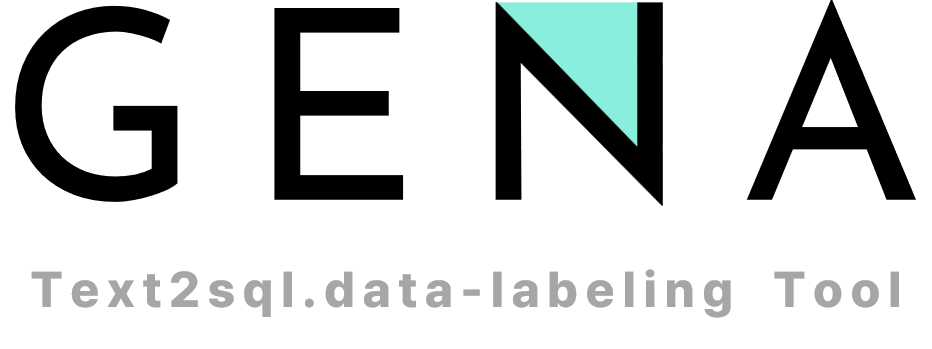

# GENA Text2sql.data-labeling Tool

The Text2SQL Data-Labeling Tool streamlines the management and updating of data for text2SQL AI training by allowing labeling and error correction in SQL queries and natural language data. It supports task assignment, version control, and real-time collaboration, enabling multiple users to efficiently label and modify/update data. The tool improves data management speed and accuracy, overcoming the limitations of manual processes.

**Currently at the PoC (Proof of Concept) level**, the tool is designed to validate its functionality and feasibility for real-world usage, with the goal of refining features before full-scale implementation.

## Development Log

For more details, refer to the development logs at [Development Log](https://bit.ly/text2sql-data-labeling-Tool-Dev-Log)

## **Features**

- Collaborative Data Labeling
- Group-Based Task Assignment
- SQL Query & Natural Question Labeling
- Version Control & Approval Flow
- CSV Export
- RESTful API

## **Usage**

You can run the Text2SQL Data-Labeling Tool with the following options:

- **Docker Compose**
    - with Java JDK 17, MySQL 8.3, and all necessary components
- **Docker**

### **Prerequisites**

This section will help users know what they need before running the tool.

- **Docker** installed

Docker Compose is used to easily set up and run the application in a containerized environment.

### **Dataset CSV File Upload Guidelines**

Before uploading a CSV file, please ensure that:

1. The file contains the following required columns:
    - `sql_query`
    - `natural_question`
    - `no_sql_template`
    - `sql_template`
    - `id`
2. `sql_query` and `natural_question` columns are the ones that users will modify during labeling.
3. `no_sql_template` and `sql_template` are non-editable reference columns that contain template number and template content, respectively, which users will use as a reference while modifying data.
4. `id` is the unique ID for each dataset row, not the tool-generated ID.
5. The file size must not exceed **10MB**. If the file is larger, consider splitting it into smaller files.
6. The column names must exactly match the required schema to ensure successful upload and proper data mapping.

Once your CSV file is ready, submit the dataset metadata along with the file to upload it to the tool for labeling.

### Docker Compose

1. Clone the repository:

    ```bash
    git https://github.com/genaasia/text2sql.data-labeling.git
    cd your-repository
    ```

2. Create a `db.env` file with the following environment variables (you can refer to `db.env.example` for guidance):

    ```
    MYSQL_DB_PASSWORD=your_password
    ADMIN_CODE=your_admin_code
    MYSQL_ROOT_PASSWORD=your_root_password
    ```

3. Run the application using Docker Compose:

    ```bash
    docker-compose --build up
    ```

4. Once the containers are up and running, you can access the Swagger UI to check and test the APIs.

    ```
    http://localhost:8080/swagger-ui/swagger-ui/index.html
    ```

## **Contact**

For help and feedback, feel free to contact [**PM/Developer**](https://github.com/andrew75313).
